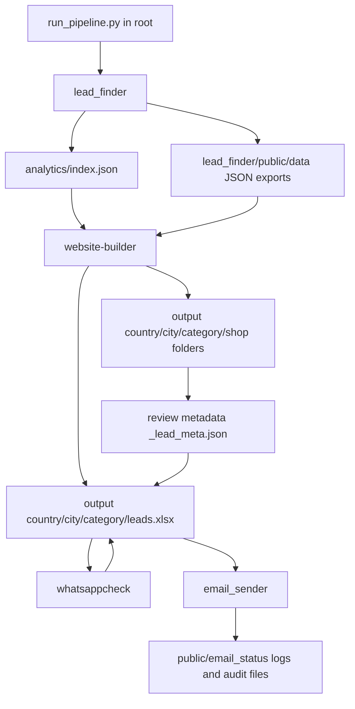

# Master Workflow Guide

## 1. Purpose Of This File

This document explains the full repository as one connected workflow.

It answers five practical questions:

1. What is this repo trying to do end to end?
2. What does each top-level folder do?
3. What is already working well in each folder?
4. What improvements are needed in each folder?
5. How can everything be run from the root with a single command?

This is written as an operations guide for anyone who opens the repo and wants to understand:

- the business flow
- the technical flow
- the file flow
- the current gaps
- the safest way to run the whole system

---

## 2. Big Picture

This repository is a multi-step local automation pipeline for finding business leads, generating websites for those leads, enriching contact data, and then reaching out to them.

At a high level, the repo is doing this:

1. `lead_finder/` scrapes and qualifies businesses.
2. `analytics/` records which city/category batches are ready for building.
3. `website-builder/` reads those ready batches and generates websites.
4. `website-builder/` also exports `leads.xlsx` reports into `output/`.
5. `whatsappcheck/` enriches those Excel reports with WhatsApp status.
6. `email_sender/` reads approved leads and sends personalized outreach.
7. `run_pipeline.py` in the root acts as the cross-folder orchestrator.

So the repo is not a single app. It is a pipeline of cooperating tools.

---

## 3. Business Goal

The business goal behind the repo appears to be:

- discover local businesses in chosen cities and categories
- identify which businesses are good prospects
- generate a sample website or improvement asset for them
- collect operational outreach data
- contact them through email, and possibly use WhatsApp signals for prioritization

In other words, this repo is a lead generation plus fulfillment plus outreach system for an agency-style workflow.

---

## 4. Current End-To-End Workflow

### 4.1 Human Summary

The current intended process is:

1. Choose a city and business categories.
2. Scrape leads from Google Maps.
3. Qualify and store those leads.
4. Track each lead batch in analytics.
5. Build websites for those leads.
6. Export grouped Excel reports.
7. Review generated websites and approve or reject them.
8. Check WhatsApp availability for the phone numbers in those reports.
9. Send outreach emails to approved and eligible leads.

### 4.2 Technical Summary

The technical flow is:

1. `lead_finder/run.py`
2. `analytics/tracker.js`
3. `website-builder/src/index.js run` or `pipeline`
4. `website-builder/src/exporter.js`
5. `website-builder/src/review.js`
6. `whatsappcheck/run.py`
7. `email_sender/agent.py`
8. `run_pipeline.py`

### 4.3 Data Flow Summary

- Raw scrape output becomes JSON under `lead_finder/public/data/`.
- Analytics receives category-level "scraped" markers in `analytics/index.json`.
- Website builder reads those JSON files and builds site folders into `output/`.
- Website builder exports `leads.xlsx` into each `output/{country}/{city}/{category}/`.
- Review metadata is stored in `_lead_meta.json` inside each generated site folder.
- WhatsApp checker updates the `whatsapp` column inside `leads.xlsx`.
- Email sender reads approved/deployed rows from those Excel reports, or falls back to JSON in some cases.

---

## 5. Visual Architecture



---

## 6. Root Folder Overview

Top-level folders and files currently visible in the repo:

- `analytics/`
- `email_sender/`
- `lead_finder/`
- `output/`
- `scripts/`
- `website-builder/`
- `whatsappcheck/`
- `.env.example`
- `PIPELINE.md`
- `run_pipeline.py`
- `new.mermaid`

The root is acting as the coordination layer. It is where shared configuration, shared output, and cross-folder orchestration live.

---

## 7. Root-Level Files And Their Role

### `run_pipeline.py`

This is the most important root file from an orchestration point of view.

It already tries to connect the major stages:

- scrape with `lead_finder`
- build with `website-builder`
- enrich with `whatsappcheck`
- send with `email_sender`

It supports:

- `--city` or `--cities`
- `--categories`
- `--max`
- `--dry-run`
- `--skip-scrape`
- `--skip-build`
- `--skip-whatsapp`
- `--skip-email`

This means the repo already has the beginnings of the "single command from root" story.

### `PIPELINE.md`

This is a short manual operator guide. It explains the main commands and environment variables, but it is not detailed enough to explain the true architecture or the gaps between stages.

### `.env.example`

This is the shared config source for the repo. It contains environment variables for:

- Groq
- Vercel
- SMTP
- agency branding
- WhatsApp defaults
- output paths

This is good because one `.env` file can drive multiple subprojects.

### `new.mermaid`

This is an architecture sketch. It is useful as a visual aid, but it is not yet a full operating guide.

---

## 8. Folder-By-Folder Breakdown

### 8.1 `lead_finder/`

### What This Folder Does

This is the lead acquisition and qualification engine.

Its job is to:

- scrape businesses from Google Maps
- optionally analyze business websites
- qualify leads
- deduplicate results
- persist them to SQLite and JSON exports
- notify analytics that a new batch is ready

### Key Files

- `run.py` - main CLI pipeline
- `scraper.py` - Google Maps scraping and enrichment
- `analyzer.py` - website quality analysis
- `qualify.py` - lead scoring logic
- `main.py` - converts raw businesses into stored qualified leads
- `database.py` - registry and persistence
- `deduplicate.py` - stable lead identity logic
- `config.py` - constants and file paths
- `location_layout.py` - city and storage layout helpers
- `public/data/` - output JSON data used downstream

### What Happens Here In Practice

1. A city and categories are selected.
2. Google Maps results are scraped.
3. For businesses with websites, the site can be analyzed.
4. Qualification rules decide whether the business is worth targeting.
5. Outputs are written per country/city/category.
6. Analytics is updated so website-building knows what is ready.

### Main Inputs

- city
- categories
- optional `--analyze-websites`
- Playwright browser access

### Main Outputs

- category JSON files under `lead_finder/public/data/{country}/{city}/{category}/`
- consolidated lead exports
- SQLite registry
- analytics "scraped" markers

### What Is Good In This Folder

- Clear separation between scraping, analysis, qualification, and persistence.
- Good attempt at local-first storage with JSON plus SQLite.
- The scraper writes category-level outputs that are easy for downstream tools to consume.
- Analytics integration is already present, which is important for orchestration.
- Category and city handling are reasonably structured.
- The design supports running many city/category batches over time.

### What Needs Improvement In This Folder

- Documentation cleanup is needed. The current README includes unresolved merge conflict markers and outdated references.
- The output contract should be formally documented. Downstream code relies on field names like `email`, `primary_email`, `social_media_links`, `place_id`, `website`, and location metadata.
- Scraping reliability could improve with stronger retry logic, captcha handling strategy, and clearer failure reporting.
- A schema version for output JSON would help future compatibility.
- There should be a stronger preflight step that checks Playwright installation and environment readiness before long runs.
- More tests would help, especially around qualification, deduplication, and export structure.

### Strategic Improvement For This Folder

This folder should become the canonical source of lead truth. That means:

- stable schema
- documented output contract
- reliable analytics updates
- minimal ambiguity for downstream tools

If `lead_finder` becomes stable, the rest of the pipeline becomes much easier to maintain.

---

### 8.2 `analytics/`

### What This Folder Does

This folder tracks batch-level lifecycle state between scraping and building.

It answers questions like:

- which city/category batch was scraped?
- which batch is building?
- which batch is built?
- which batch is deployed?
- which batch hit an error?

### Key Files

- `tracker.js` - status writer and reader
- `index.json` - persisted analytics state
- `README.md` - brief field description

### What Happens Here In Practice

When `lead_finder` completes a category export, it marks that batch as `scraped`.

When `website-builder` begins work, it marks the batch as `building`.

After building and deployment, it marks the batch as `built` or `deployed`, and also tracks errors.

### What Is Good In This Folder

- Very simple mental model.
- Easy to inspect manually because it is just JSON.
- Gives `website-builder` a clean readiness signal.
- Prevents accidental reprocessing of already-tracked batches.

### What Needs Improvement In This Folder

- There is no stronger concurrency protection around writes to `index.json`.
- There is no schema versioning.
- There is no dashboard beyond raw JSON and CLI summaries.
- Error history is shallow. It stores the latest error, but operational diagnosis could be richer.
- Since this file is central to orchestration, corruption or inconsistent writes could disrupt the pipeline.

### Strategic Improvement For This Folder

Keep the simplicity, but add:

- file-locking or atomic-write guarantees
- schema versioning
- a root command to inspect health
- clearer operator docs on status transitions

---

### 8.3 `website-builder/`

### What This Folder Does

This is the website generation and deployment engine.

Its job is to:

- read ready leads
- choose a matching website template
- fill content using Groq
- generate the website code
- optionally deploy to Vercel
- export reporting Excel files
- support preview and review

### Key Files

- `src/index.js` - CLI entrypoint
- `src/commands/run.js` - main build loop
- `src/commands/pipeline.js` - local pipeline wrapper
- `src/leads_json.js` - reads JSON leads using analytics gating
- `src/exporter.js` - writes `leads.xlsx`
- `src/review.js` - manages review metadata sync
- `src/deployer.js` - Vercel deployment
- `src/matcher.js` - template matching
- `src/filler.js` - template filling
- `src/config.js` - shared config loading
- `global-website/` - reusable site templates

### What Happens Here In Practice

1. It reads pending leads, usually from JSON exported by `lead_finder`.
2. It groups them by country/city/category.
3. It marks those groups as `building` in analytics.
4. It matches a website template based on category.
5. It fills the template with business-specific content.
6. It writes generated site folders into `output/`.
7. It optionally deploys those sites to Vercel.
8. It exports `leads.xlsx` reports into each output category folder.
9. It stores review metadata in `_lead_meta.json` alongside generated sites.

### Main Outputs

- generated websites under `output/{country}/{city}/{category}/{shop_id}/`
- `leads.xlsx` under `output/{country}/{city}/{category}/`
- analytics updates
- review metadata files

### What Is Good In This Folder

- Strong modular structure. Commands, config, matching, filler, exporter, review, and deploy logic are separated.
- JSON lead ingestion is a good bridge from `lead_finder`.
- Excel report export is a very practical integration choice for business workflows.
- Review metadata syncing is a strong idea because it turns generated output into a manageable approval process.
- Dry-run, preview, and deployment modes give useful operational flexibility.
- The templates are organized and reusable.

### What Needs Improvement In This Folder

- There are two orchestration paths: `website-builder/src/commands/pipeline.js` and root `run_pipeline.py`. That duplication can drift over time.
- Review is operationally important, but it is not enforced as a hard gate before outreach.
- Status vocabulary across the system needs tightening. Terms like `processing`, `built`, `deployed`, `dry-run`, `error`, and `status` vs `build_status` can become confusing.
- More explicit documentation is needed for how `_lead_meta.json` and `leads.xlsx` interact.
- Failure recovery could be more ergonomic, especially for partial runs and re-runs.
- Template quality evaluation could be more measurable.

### Strategic Improvement For This Folder

This folder should become the canonical build and review stage.

That means:

- analytics tells it what is ready
- it produces reviewable artifacts
- review approval becomes authoritative
- downstream systems only consume approved results

This is already mostly the case, but it should be made explicit and enforced.

---

### 8.4 `whatsappcheck/`

### What This Folder Does

This folder enriches the generated Excel reports with WhatsApp availability signals.

Its job is to:

- scan one or many `leads.xlsx` files
- read the `phone` column
- check if the number appears reachable on WhatsApp
- write the result into a `whatsapp` column

### Key Files

- `run.py` - CLI entrypoint
- `excel_updater.py` - Excel scanning and updates
- `checker.py` - phone normalization and request logic

### What Happens Here In Practice

1. It finds `leads.xlsx` under `output/`.
2. It reads each row's phone number.
3. It skips rows with no phone or already-checked WhatsApp status.
4. It checks the number using a `wa.me` signal.
5. It writes `YES`, `NO`, `INVALID`, or `ERROR` back into Excel.

### What Is Good In This Folder

- Very small and easy to reason about.
- Idempotent behavior is already built in because it skips rows that were already checked.
- The output is business-friendly because the result lands directly in `leads.xlsx`.
- Dry-run mode exists.

### What Needs Improvement In This Folder

- The WhatsApp detection method is a heuristic and may not always be reliable.
- More robust retry, timeout, and error classification would help.
- A cache could avoid rechecking the same phone across multiple files or reruns.
- The result is currently enrichment only; it is not yet strongly connected to contact prioritization logic.
- There is no reporting summary file beyond console logs.

### Strategic Improvement For This Folder

This folder should become a lead enrichment layer rather than just a utility.

That means:

- better confidence scoring
- caching
- optional prioritization rules
- clearer downstream usage by email and future outreach tools

---

### 8.5 `email_sender/`

### What This Folder Does

This folder is the outreach engine.

Its job is to:

- load eligible leads
- generate personalized email content
- enforce guardrails
- apply rate limits
- send through SMTP
- store audit trails and send logs

### Key Files

- `agent.py` - primary sender
- `run.py` - compatibility wrapper
- `excel_leads.py` - loads approved/deployed rows from Excel
- `guardrails.py` - validates generated content
- `rate_limiter.py` - hourly and daily controls
- `retry_utils.py` - retry behavior
- `audit_store.py` - JSONL and audit log helpers
- `validation.py` - template validation
- `tests/test_email_system.py` - tests

### What Happens Here In Practice

The sender can work in two modes:

1. Preferred mode: load eligible rows from `output/.../leads.xlsx`
2. Fallback mode: load leads from JSON under `lead_finder/public/data/`

The preferred Excel path is important because it requires:

- `build_status == deployed`
- `review_status == approved`
- `email` present

That means the sender is designed to work after website generation and human review.

It then:

- filters invalid or suppressed emails
- optionally generates email copy via Groq
- validates the result with guardrails
- applies rate limits
- sends mail through SMTP
- writes logs and status files

### Cross-Folder Dependency To Notice

`email_sender/agent.py` depends on template files stored in `lead_finder/`:

- `lead_finder/category_bucket.json`
- `lead_finder/bucket_email_template.json`

So this folder is not isolated. It depends on both root `.env` and template data from another module.

### What Is Good In This Folder

- Strong operational safety relative to many simple outreach scripts.
- Includes suppression handling, blocked domains, retries, and rate limits.
- Has audit logging and JSONL event storage.
- Supports dry-run behavior.
- Excel-first loading is a smart design because it aligns with reviewed outputs.

### What Needs Improvement In This Folder

- The config and data dependencies should be documented more clearly.
- The root-level storage path for email status logs should be more explicit as part of repo architecture.
- There is an important difference between Excel mode and JSON fallback mode that should be made clearer to operators.
- Better preflight diagnostics would help users know exactly why nothing is being sent.
- The sender currently relies on several prerequisites that can fail silently from the operator point of view: missing `.env`, missing template JSON validity, no approved rows, no deployed rows, or no usable email.
- There is room for stronger campaign-level reporting.

### Strategic Improvement For This Folder

This folder should become the canonical outreach stage after review approval.

It should eventually have:

- a preflight command
- clear campaign summary output
- stronger integration with upstream review status
- optional prioritization using WhatsApp or lead score

---

### 8.6 `output/`

### What This Folder Does

This is the shared artifact store for the pipeline.

It contains:

- generated websites
- grouped Excel reports
- sidecar review metadata
- possibly other generated assets

It is effectively the handoff point between building, review, enrichment, and outreach.

### What Is Good In This Folder

- It gives the whole repo one shared artifact location.
- The nested structure by country/city/category is logical.
- It is easy for operators to inspect manually.

### What Needs Improvement In This Folder

- This folder is serving multiple roles at once: website output, reporting output, and operational handoff.
- Retention and cleanup rules are not yet clearly documented.
- Generated code, reports, and transient metadata could eventually be separated more clearly.
- Very large output folders will become hard to manage over time.

### Strategic Improvement For This Folder

Treat `output/` as a formal artifact contract.

That means documenting:

- folder naming rules
- required files per category batch
- what is safe to delete
- what downstream tools rely on

---

### 8.7 `scripts/`

### What This Folder Does

This folder helps bootstrap Node in a project-local way.

It includes:

- `setup-node.cmd`
- `setup-node.ps1`
- wrappers like `node.cmd`, `npm.cmd`, and `npx.cmd`

### What Is Good In This Folder

- Very practical for Windows users.
- Reduces dependency on a globally installed Node setup.
- Makes it easier to standardize runtime version for `website-builder`.

### What Needs Improvement In This Folder

- The scripts folder is helpful, but its relationship to `run_pipeline.py` is not yet fully integrated.
- There is no equivalent bootstrap convenience for Python environments.
- The root docs should explain when to use local Node wrappers versus system Node.

### Strategic Improvement For This Folder

This folder should become the runtime bootstrap layer for the whole repo, not just Node.

Potential future additions:

- Python setup helper
- dependency validation
- root preflight checks

---

### 8.8 `__pycache__/`

This is runtime-generated cache and not part of the business workflow.

It does not need architecture investment beyond normal ignore and cleanup hygiene.

---

## 9. How The Folders Connect Today

This is the most important connection map in plain language.

### Stage 1: Root To Lead Finder

The root orchestrator runs:

```powershell
python run_pipeline.py --city bengaluru --categories "salon,gym" --max 50
```

That calls `lead_finder/run.py`.

### Stage 2: Lead Finder To Analytics

After category JSON files are written, `lead_finder/scraper.py` notifies `analytics/tracker.js`.

This marks each batch as `scraped`.

### Stage 3: Analytics To Website Builder

`website-builder/src/leads_json.js` reads ready-to-build analytics entries and then loads the corresponding JSON lead files.

This is how the build stage knows which batches are pending.

### Stage 4: Website Builder To Output

`website-builder` generates:

- site folders
- lead metadata files
- Excel reports

All of that is written under `output/`.

### Stage 5: Output To Review

Review metadata lives beside the generated site folders.

The review dashboard lets the operator approve or reject generated sites, and review status syncs back into `leads.xlsx`.

### Stage 6: Output To WhatsApp Check

`whatsappcheck` reads `leads.xlsx`, checks phones, and updates the same workbook.

### Stage 7: Output To Email Sender

`email_sender` prefers Excel rows that are:

- deployed
- approved
- have an email

If no eligible Excel rows are found, it may fall back to JSON leads.

---

## 10. What Is Already Good About The Overall Architecture

- The repo already has a real pipeline shape, not just unrelated scripts.
- There is already a root orchestrator.
- The system uses explicit file handoffs, which makes manual inspection easy.
- Analytics gives a real status bridge between scraping and building.
- The review layer exists, which is important for quality control.
- Excel output is practical for operations and sales workflows.
- Outreach has meaningful safety features.

This means the repo is not starting from zero. The foundation for a one-command workflow is already present.

---

## 11. Main Cross-Cutting Problems To Fix

These are not single-folder problems. They affect the whole repo.

### 11.1 Two Pipeline Entry Points

There are two orchestration stories:

- root `run_pipeline.py`
- `website-builder`'s own `pipeline` command

This can create drift.

Recommendation:

- make `run_pipeline.py` the canonical root orchestrator
- make `website-builder pipeline` either a thin wrapper or remove it from normal operator flow

### 11.2 Review Is Important But Not Hard-Gated At Root

The repo logically wants:

scrape -> build -> review -> enrich -> outreach

But the root pipeline currently runs steps in one pass. In production, outreach should not proceed until review approval is complete.

Recommendation:

- treat review as a required checkpoint
- either split pipeline into phases or add a hard approval gate

### 11.3 Status Vocabulary Needs Tightening

Different parts of the repo use overlapping status concepts:

- analytics status
- build status
- review status
- lead status
- email status
- WhatsApp result

Recommendation:

- define a repo-wide status glossary
- document which file owns which status

### 11.4 Schema Contract Needs To Be Explicit

Multiple folders depend on shared fields, but there is no single schema contract document.

Recommendation:

- define canonical lead schema
- define canonical report schema
- define canonical analytics schema

### 11.5 Root Dry Run Is Not Fully Safe Yet

Current root `--dry-run` still passes `--dry-run` to `email_sender`, but not `--dry-run-no-groq`.

That means a root dry run can still require:

- Groq API access
- sender branding config
- email template config

And it may still consume AI generation cost.

Recommendation:

- root dry run should pass `--dry-run --dry-run-no-groq` to email sender
- add a root preflight mode that validates setup without external side effects

### 11.6 Documentation Needs Consolidation

There are useful docs, but the operator story is spread across:

- `PIPELINE.md`
- `lead_finder/README.md`
- `website-builder/README.md`
- `analytics/README.md`
- code itself

Recommendation:

- use this file as the central architecture guide
- keep subfolder READMEs focused on folder-local usage

---

## 12. How To Run Everything From Root Today

### 12.1 Best Current Root Command

For a dry-run style pipeline:

```powershell
python run_pipeline.py --city bengaluru --categories "salon,gym" --max 50 --dry-run
```

For a live run:

```powershell
python run_pipeline.py --city bengaluru --categories "salon,gym" --max 50
```

For multiple cities:

```powershell
python run_pipeline.py --cities "bengaluru,mysuru" --categories "salon,gym" --max 50
```

For phased runs:

```powershell
python run_pipeline.py --city bengaluru --categories "salon,gym" --max 50 --skip-email
python run_pipeline.py --city bengaluru --categories "salon,gym" --skip-scrape --skip-build
```

### 12.2 What That Root Command Actually Does

When run normally, `run_pipeline.py` tries to execute:

1. `lead_finder/run.py`
2. `website-builder/src/index.js run`
3. `whatsappcheck/run.py`
4. `email_sender/agent.py`

So technically the repo already has a one-command cross-folder runner.

### 12.3 What The Operator Must Still Know

Even though there is a root command, the business workflow is not fully one-click safe yet because:

- Node must be available for `website-builder`
- `.env` must exist at repo root
- review approval must happen before email if you want quality control
- email templates must be valid
- email sender will send only approved/deployed Excel rows

So the correct statement is:

The repo already supports one-command orchestration, but it still needs stronger workflow gating and preflight checks before it becomes a fully safe production one-command system.

---

## 13. Recommended Production Workflow

If this repo is used seriously, the safest operator flow should be:

### Phase A: Discovery And Build

```powershell
python run_pipeline.py --city bengaluru --categories "salon,gym" --max 50 --skip-email
```

This gives:

- scraped leads
- analytics tracking
- generated sites
- Excel reports
- WhatsApp enrichment

### Phase B: Human Review

Run the review dashboard, inspect generated sites, and approve or reject each site.

Example:

```powershell
cd website-builder
node src/index.js review
```

### Phase C: Outreach

After review approval is complete, run only the email stage:

```powershell
python run_pipeline.py --city bengaluru --categories "salon,gym" --skip-scrape --skip-build --skip-whatsapp
```

This phased model is closer to how the repo is already designed.

---

## 14. Recommended Improvements To Truly Support A Single Command

If the goal is a real single-command production-safe workflow from root, these changes are recommended.

### Priority 1 - Make `run_pipeline.py` The Canonical Orchestrator

- Keep orchestration logic in one place.
- Let other subcommands call into it or remain folder-local only.

### Priority 2 - Add A Root `--preflight` Mode

It should validate:

- `.env` exists
- required env vars for selected stages exist
- Node is available
- Python dependencies are available
- Playwright is available
- email template JSON files are valid
- output paths are writable

### Priority 3 - Add A Real Review Gate

Examples:

- `--require-approved-review`
- `--pause-after-build`
- `--auto-approve` only for experimental workflows

Without this, one-command outreach is risky.

### Priority 4 - Make Root Dry Run Fully Non-Sending And Non-Generating

Root `--dry-run` should:

- skip deploy
- skip SMTP send
- skip Groq generation in email sender
- produce a safe validation report

### Priority 5 - Publish Shared Schema Docs

Create a schema guide for:

- lead JSON
- analytics entries
- Excel report columns
- review metadata
- email status files

### Priority 6 - Add End-To-End Smoke Tests

At minimum:

- sample city/category fixture
- fake output build
- fake report export
- fake review approval
- fake WhatsApp enrichment
- fake email dry-run eligibility

---

## 15. Suggested Improvement Plan By Folder

### Root

- Make `run_pipeline.py` the single source of orchestration truth.
- Add `--preflight`.
- Make dry-run fully safe.
- Add better summary reporting at the end of a run.

### `lead_finder/`

- Clean README and remove merge conflict markers.
- Document output schema.
- Add stronger tests and scraper recovery.

### `analytics/`

- Add atomic writes and schema version.
- Improve visibility into errors and readiness.

### `website-builder/`

- Enforce review gate more clearly.
- Reduce duplication with root orchestration.
- Clarify status ownership and report contract.

### `whatsappcheck/`

- Improve confidence, caching, and reporting.
- Make downstream prioritization possible.

### `email_sender/`

- Add preflight and operator-facing diagnostics.
- Clarify Excel mode vs JSON fallback mode.
- Improve campaign reporting and cross-stage integration.

### `output/`

- Document artifact contract.
- Separate transient versus durable generated assets if scale grows.

### `scripts/`

- Expand to a full repo bootstrap layer, not just Node setup.

---

## 16. Practical "What We Are Doing In Each Folder" Summary

If someone asks for the simplest explanation possible, use this:

- `lead_finder/` - we find and qualify businesses.
- `analytics/` - we remember which scraped batches are ready to build.
- `website-builder/` - we generate websites and export reviewable reports.
- `output/` - we store generated sites and grouped Excel reports.
- `whatsappcheck/` - we enrich those reports with WhatsApp availability.
- `email_sender/` - we send personalized email outreach to approved leads.
- `scripts/` - we help the repo run consistently, especially Node tooling.
- root files - we configure and orchestrate the whole flow.

---

## 17. Best Final Architecture Direction

The best long-term direction for this repo is:

1. Root owns orchestration.
2. `lead_finder` owns lead truth.
3. `analytics` owns batch readiness.
4. `website-builder` owns site generation and review.
5. `output` owns shared artifacts.
6. `whatsappcheck` owns enrichment.
7. `email_sender` owns outreach.

That division is already mostly visible in the repo. The next step is to harden it, document it, and remove ambiguous behavior.

---

## 18. Final Recommendation

If you want to operate this repo with confidence, treat it as a staged pipeline with one root entrypoint.

Use `run_pipeline.py` as the central command, but in real use prefer:

- build phase first
- review second
- outreach last

The repo is already close to a full single-command workflow, but to make it truly production-ready it still needs:

- a preflight layer
- stronger review gating
- one canonical orchestrator
- better shared schema documentation

This file should be kept at the root and updated whenever the pipeline contract changes.
