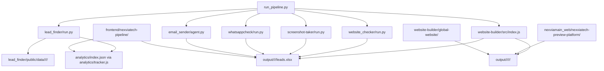
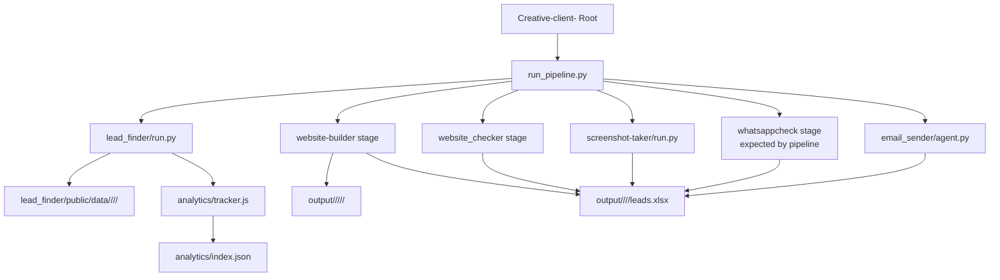
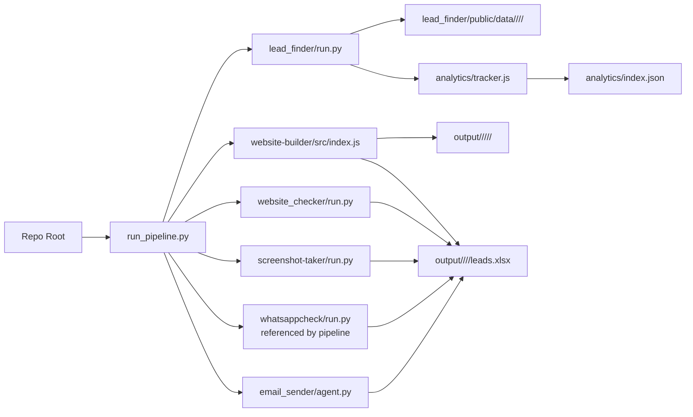

# Project Map

This document reflects the repo as it exists right now in the working tree on `2026-04-30`.

## Repo Snapshot

- Canonical orchestrator: `run_pipeline.py`
- Core Python stage present: `lead_finder/`
- Final outreach stage present: `email_sender/`
- Batch state tracker present: `analytics/`
- Generated artifacts present: `output/`
- Dashboard/ops frontend present: `frontend/nexviatech-pipeline/`
- Standalone preview app present: `nexviamain_web/nexviatech-preview-platform/`
- Template library present: `website-builder/global-website/`
- Pipeline stage paths currently present under `Leads/backend/`:
  - `website-builder/src/`
  - `website_checker/run.py`
  - `whatsappcheck/run.py`

## High-Level Flow

## Root

### Root Flowchart

### Root Workflow Diagram

- `run_pipeline.py`: main orchestration script. It coordinates scrape, build, check, screenshot, WhatsApp, and email stages.
- `README.md`: top-level repo overview.
- `ARCHITECTURE.md`: architecture notes for the pipeline.
- `PIPELINE.md`: operational commands and pipeline usage.
- `SCHEMA.md`: shared data contract notes.
- `STATUS_GLOSSARY.md`: status definitions.
- `MASTER_WORKFLOW_GUIDE.md`: longer workflow guide.
- `command.md`: short command reference.
- `new.mermaid`: older Mermaid diagram source.
- `.env`, `.env.example`: environment configuration.
- `package-lock.json`: root npm lockfile.

## Present Top-Level Directories

### `analytics/`

Tracks batch-level state between scrape and downstream stages.

- `analytics/tracker.js`: read/write helper for pipeline batch status.
- `analytics/index.json`: current analytics registry.
- `analytics/README.md`: tracker notes.

### `data/`

Shared runtime SQLite storage.

- `data/bizsitegen.sqlite`
- `data/bizsitegen.sqlite-shm`
- `data/bizsitegen.sqlite-wal`

### `email_sender/`

Final outreach stage. Reads eligible leads, generates emails, sends them, and writes audit data.

- `email_sender/agent.py`: primary sender.
- `email_sender/run.py`: compatibility launcher.
- `email_sender/excel_leads.py`: lead loading from workbook/output paths.
- `email_sender/validation.py`: template and config validation.
- `email_sender/guardrails.py`: generated email checks.
- `email_sender/rate_limiter.py`: send throttling.
- `email_sender/retry_utils.py`: retry helpers.
- `email_sender/audit_store.py`: audit/event persistence.
- `email_sender/tests/test_email_system.py`: test coverage for the email system.

### `frontend/`

Operational dashboard layer, not the source of truth for the pipeline.

#### `frontend/nexviatech-pipeline/`

- `run_pipeline.py`, `pipeline.py`: compatibility wrappers.
- `README.md`, `RUN_AND_VERIFY.md`, `requirements.txt`

#### `frontend/nexviatech-pipeline/dashboard/api/`

- `main.py`: FastAPI service for analytics, stats, and events.
- `requirements.txt`: API dependencies.

#### `frontend/nexviatech-pipeline/dashboard/web/`

- `app/page.tsx`: main dashboard page.
- `app/layout.tsx`: root layout.
- `app/globals.css`: shared styles.
- `package.json`, `package-lock.json`
- `next.config.js`, `tailwind.config.js`, `postcss.config.js`, `tsconfig.json`
- `dev-server.js`, `build-server.js`

### `image/`

Small scratch/assets area.

### `lead_finder/`

Scraping, website analysis, qualification, and export stage.

- `run.py`: main stage entrypoint.
- `main.py`: qualification/export flow.
- `scraper.py`: Google Maps scraping.
- `analyzer.py`: website quality checks.
- `qualify.py`: lead scoring and eligibility logic.
- `database.py`: SQLite and registry helpers.
- `deduplicate.py`: duplicate detection.
- `models.py`: lead models.
- `config.py`: paths and constants.
- `location_layout.py`: country/city/category path resolution.
- `categories.txt`, `categories_indian.txt`: category lists.
- `category_bucket.json`: category to email bucket mapping.
- `bucket_email_template.json`: shared email template config.
- `registry.json`, `scrape_progress.json`, `scraped.db`: local state.
- `README.md`, `README_QUICKSTART.md`, `requirements.txt`, `requirements.md`, `command.txt`

#### `lead_finder/public/data/`

Canonical exported lead data.

- `_city_country_cache.json`: city to country cache.
- `india/<city>/scraped.db`
- `india/<city>/scrape_progress.json`
- `india/<city>/<category>/no_web_leads.json`
- `india/<city>/<category>/weak_web_leads.json`
- `india/<city>/<category>/ineligible_leads.json`

### `nexviamain_web/`

Standalone Vite app for the Nexvia preview platform. This is separate from the dashboard under `frontend/`.

#### `nexviamain_web/nexviatech-preview-platform/`

- `src/App.tsx`, `src/main.tsx`, `src/index.css`
- `src/pages/`: `Home.tsx`, `BusinessPreview.tsx`, `Portfolio.tsx`, `Pricing.tsx`, `Contact.tsx`, `NotFound.tsx`
- `src/components/`: `Layout.tsx`, `Navbar.tsx`, `Footer.tsx`
- `src/data/mockBusinessData.ts`
- `package.json`, `package-lock.json`
- `vite.config.ts`, `tsconfig.json`, `vercel.json`
- `metadata.json`, `.env.example`, `README.md`

### `output/`

Generated site artifacts and handoff workbooks.

- `output/processed_leads.json`: processed lead registry.
- `output/<country>/<city>/<category>/leads.xlsx`: per-batch workbook.
- `output/<country>/<city>/<category>/<shop_id>/`: generated site folder per lead.

Common files inside each generated site folder:

- `_lead_meta.json`
- `metadata.json`
- `package.json`
- `vite.config.ts`
- `tsconfig.json`
- `index.html`
- `src/App.tsx`
- `src/main.tsx`
- `src/index.css`
- `.env.example`
- `README.md`

### `screenshot-taker/`

Screenshot capture stage.

- `screenshot-taker/run.py`: scans workbook/site output and writes screenshot paths.
- `screenshot-taker/README.md`

### `scripts/`

Windows-local Node wrapper/setup scripts.

- `setup-node.cmd`
- `setup-node.ps1`
- `node.cmd`
- `npm.cmd`
- `npx.cmd`

### `website-builder/`

Currently acts mainly as a template and asset area in this working tree.

- `package.json`, `package-lock.json`
- `README.md`
- `category-map.json`
- `.env.example`
- `errors.log`
- `data/`: builder-local SQLite files
- `leads/`: workbook/input area
- `global-website/`: reusable template library

Important current note:

- The old builder CLI source files under `website-builder/src/` are not present right now, even though `run_pipeline.py` and `website-builder/README.md` still reference them.

#### `website-builder/global-website/`

Template families currently present:

- `atelier-spa`
- `auto-garage`
- `barber-tattoo`
- `catering-delivery`
- `coaching-pro`
- `events-planner`
- `finance-&-accounting-firm`
- `general-business`
- `gym-fitness`
- `home-services`
- `law-firm`
- `medical-dental`
- `multi-purpose-retail-store`
- `nexus-heavy-industries`
- `real-estate`
- `restaurant-cafe`
- `school-academy`
- `tech-agency`
- `travel-hotel`
- `wellness-clinic`

Each template usually includes:

- `src/App.tsx`
- `src/main.tsx`
- `src/index.css`
- `index.html`
- `package.json`
- `vite.config.ts`
- `tsconfig.json`
- `metadata.json`
- `.env.example`
- `README.md`

## Missing but Still Referenced by Pipeline Code

These paths are referenced by `run_pipeline.py` but are not currently present in the working tree:

- `website-builder/src/index.js`
- `website_checker/run.py`
- `whatsappcheck/run.py`
- `whatsappcheck/checker.py`
- `whatsappcheck/excel_updater.py`

If those removals were intentional, `run_pipeline.py`, `README.md`, and `PIPELINE.md` likely still need follow-up cleanup.

## Generated and Cache Areas

These appear throughout the repo and are not core source:

- `.git/`
- `node_modules/`
- `__pycache__/`
- `*.sqlite-shm`
- `*.sqlite-wal`
- `tsconfig.tsbuildinfo`
