# Detailed Workflow Flowchart

This file gives the pipeline its own detailed visual map.

## End-to-End Flow

```mermaid
flowchart TD
    ROOT[Creative-client-] --> ENV[".env / .env.example"]
    ROOT --> PIPE["run_pipeline.py<br/>canonical orchestrator"]
    ROOT --> MAP["PROJECT_MAP.md"]
    ROOT --> ARCH["ARCHITECTURE.md / PIPELINE.md"]

    PIPE --> PREFLIGHT["Preflight checks<br/>env, deps, output dir, CLI availability"]
    PIPE --> CITYLOOP["Loop through selected city/cities"]

    CITYLOOP --> LF["lead_finder/run.py"]
    LF --> LF1["Scrape Google Maps listings"]
    LF --> LF2["Analyze websites if enabled"]
    LF --> LF3["Qualify and score leads"]
    LF --> LF4["Write JSON/DB exports"]

    LF4 --> LFDATA["lead_finder/public/data/<country>/<city>/<category>/"]
    LF4 --> SCRAPEDDB["scraped.db / scrape_progress.json"]
    LF4 --> ANALYTICS["analytics/tracker.js"]
    ANALYTICS --> INDEX["analytics/index.json"]

    CITYLOOP --> WATCH["website-builder watcher<br/>started by run_pipeline.py"]
    WATCH --> WBCLI["website-builder/src/index.js watch<br/>referenced by pipeline"]
    WBCLI --> WBENV["Env filters:<br/>USE_JSON_LEADS<br/>JSON_LEADS_CITY_SLUG<br/>JSON_LEADS_COUNTRY_SLUG<br/>JSON_LEADS_CATEGORY_FILTER"]
    WBENV --> TEMPLATES["website-builder/global-website/*"]
    WBENV --> CATEGORYMAP["website-builder/category-map.json"]

    WBCLI --> SITEGEN["Generate website per lead"]
    SITEGEN --> SITEOUT["output/<country>/<city>/<category>/<shop_id>/"]
    SITEGEN --> XLSX["output/<country>/<city>/<category>/leads.xlsx"]
    SITEGEN --> PROCESSED["output/processed_leads.json"]

    SITEOUT --> SITEFILES["_lead_meta.json<br/>metadata.json<br/>index.html<br/>src/App.tsx<br/>src/main.tsx<br/>src/index.css"]

    PIPE --> REVIEWPAUSE["Optional: --pause-after-build"]
    REVIEWPAUSE --> REVIEWCMD["node website-builder/src/index.js review<br/>referenced in pipeline docs/code"]

    PIPE --> CHECK["website_checker/run.py<br/>referenced by pipeline, not present in current tree"]
    CHECK --> CHECK1["Validate generated/deployed sites"]
    CHECK1 --> XLSX

    PIPE --> SHOT["screenshot-taker/run.py"]
    SHOT --> SHOT1["Capture screenshots for approved/generated sites"]
    SHOT1 --> XLSX

    PIPE --> WA["whatsappcheck/run.py<br/>referenced by pipeline, not present in current tree"]
    WA --> WA1["Check WhatsApp availability"]
    WA1 --> XLSX

    PIPE --> EMAIL["email_sender/agent.py"]
    EMAIL --> EMAIL1["Load eligible rows from output workbooks"]
    EMAIL --> EMAIL2["Validate shared template files"]
    EMAIL --> EMAIL3["Generate outreach via Groq when enabled"]
    EMAIL --> EMAIL4["Send mail via SMTP"]
    EMAIL --> EMAIL5["Write audit logs and events"]

    EMAIL2 --> BUCKETS["lead_finder/category_bucket.json"]
    EMAIL2 --> TEMPLATESJSON["lead_finder/bucket_email_template.json"]
    EMAIL1 --> XLSX
    EMAIL5 --> EMAILSTATUS["public/email_status/ and audit logs"]

    ROOT --> FRONTEND["frontend/nexviatech-pipeline/"]
    FRONTEND --> API["dashboard/api/main.py"]
    FRONTEND --> WEB["dashboard/web/app/page.tsx"]
    API --> INDEX
    API --> XLSX
    WEB --> API

    ROOT --> PREVIEW["nexviamain_web/nexviatech-preview-platform/"]
    PREVIEW --> PREVIEWPAGES["Standalone Vite preview pages"]
    PREVIEWPAGES --> SITEOUT
```

## Notes

- `run_pipeline.py` is still the canonical orchestrator.
- The flowchart includes both present modules and pipeline-referenced modules that are currently missing from the working tree.
- The dedicated dashboard under `frontend/` and the standalone preview app under `nexviamain_web/` are separate from the core pipeline, but both relate to generated/output data.
